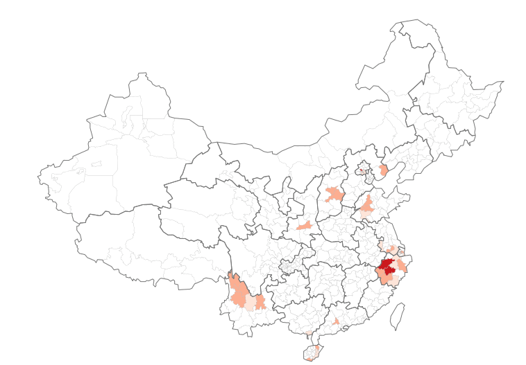

# China Map with D3.js and GeoJSON

* The necessary data files are in the *data* folder.
* china\_cities.json, china\_cities.csv, and china_provinces.json come from [GeoMap](http://xbingoz.com/demo/geomap/index.php).
